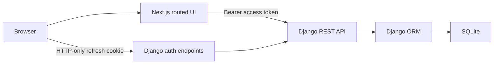

# Spend Tracker — Project Discussion and Implementation Plan

**Discussion status:** Agreed planning baseline  
**Recorded:** 2026-09-21  
**Implementation status:** Not started  

This file records the agreed product behavior and the proposed implementation plan. The code snippets are design examples only. They are not a substitute for the item-specific specifications, generated scaffolding, compatibility checks, tests, or implementation review required before code is shipped.

## 1. Agreed scope

The application will be a small, authenticated spend tracker with a Django REST API and a Next.js frontend.

Required behavior:

- Users register and sign in with email and password.
- Users can only see and summarize their own expenses.
- Users can create an expense with an amount, category, optional note, and expense date.
- Users can list expenses and filter them by category and an inclusive date range.
- Users can view a selected month's total, totals by category, and the change from the previous month.
- The summary flags categories whose spend increased by more than 20% from the previous month.
- SQLite is the first database, with real migrations and persistent storage.
- The frontend uses URL routes and URL query parameters rather than modal-only or hidden in-memory navigation.
- Automated tests cover core behavior and failure cases.
- The root README explains setup, design decisions, trade-offs, future improvements, and AI use.
- Deployment is owned by the repository owner and is not part of the initial implementation.

## 2. Decisions made during discussion

### Technology

- Backend: Django, Django REST Framework, and Simple JWT.
- Frontend: Next.js App Router with TypeScript and ESLint.
- Database: SQLite for the assignment.
- Authentication: short-lived access JWT in frontend memory; rotating refresh JWT in an HTTP-only cookie.
- User identity: a custom Django user model using unique email as the login identifier, with no username field.
- Money: one currency with two decimal places; no currency symbol is assumed.

Why Django was selected:

- Authentication is a base requirement rather than an optional extra.
- Django provides password hashing, a user framework, an ORM, migrations, admin support, configuration checks, and test utilities.
- Django REST Framework supplies request validation, authentication hooks, permissions, consistent responses, and API testing helpers.
- FastAPI would remain a valid choice for the small expense API, but it would require assembling more authentication and persistence infrastructure for this scope.

### Important Simple JWT limitation

Simple JWT normally reads access tokens from the `Authorization` header and returns refresh tokens in JSON. It does not provide the agreed refresh-cookie flow by default. The authentication endpoints therefore need small, explicit wrappers that:

- return the access token in the response body;
- place the refresh token in an HTTP-only cookie;
- read that cookie during refresh and logout;
- rotate refresh tokens and replace the cookie;
- blacklist replaced or logged-out refresh tokens; and
- apply cookie and cross-site request protections.

### Money policy

- Public API amounts are plain decimal strings such as `"125.50"`.
- The API accepts positive amounts with at most two decimal places.
- Excess precision is rejected. For example, `"125.505"` is a validation error rather than a value to round.
- The API boundary converts `"125.50"` to `12550` minor units exactly once.
- Models, services, selectors, queries, aggregation, and comparison logic use integer minor units only.
- Response serializers convert minor units back to fixed two-place decimal strings.
- The frontend has one display formatter; monetary division and formatting are not scattered through components.
- Percentage calculations use `Decimal` and `ROUND_HALF_UP` to two percentage places. This rounding rule applies to ratios, not money.
- The first release uses a scale of 100. A future multi-currency design would store currency and scale metadata rather than assuming every currency has two minor-unit digits.

## 3. Repository structure

```text
/
├── backend/
│   ├── pyproject.toml
│   ├── .env.example
│   ├── src/
│   │   ├── manage.py
│   │   ├── config/
│   │   │   ├── settings/
│   │   │   │   ├── base.py
│   │   │   │   ├── development.py
│   │   │   │   └── test.py
│   │   │   ├── urls.py
│   │   │   ├── asgi.py
│   │   │   └── wsgi.py
│   │   └── apps/
│   │       ├── accounts/
│   │       │   ├── migrations/
│   │       │   ├── models.py
│   │       │   ├── managers.py
│   │       │   ├── serializers.py
│   │       │   ├── services.py
│   │       │   ├── views.py
│   │       │   └── urls.py
│   │       └── expenses/
│   │           ├── migrations/
│   │           ├── models.py
│   │           ├── serializers.py
│   │           ├── selectors.py
│   │           ├── services.py
│   │           ├── views.py
│   │           └── urls.py
│   └── tests/
│       ├── accounts/
│       └── expenses/
├── frontend/
│   ├── package.json
│   ├── .env.example
│   ├── public/
│   └── src/
│       ├── app/
│       │   ├── (auth)/
│       │   │   ├── login/page.tsx
│       │   │   └── register/page.tsx
│       │   ├── (protected)/
│       │   │   ├── expenses/page.tsx
│       │   │   ├── expenses/new/page.tsx
│       │   │   ├── summary/page.tsx
│       │   │   └── layout.tsx
│       │   ├── layout.tsx
│       │   ├── page.tsx
│       │   ├── loading.tsx
│       │   ├── error.tsx
│       │   └── not-found.tsx
│       ├── components/
│       ├── features/
│       │   ├── auth/
│       │   └── expenses/
│       ├── lib/
│       │   ├── api/
│       │   ├── auth/
│       │   └── money/
│       └── types/
├── docs/
│   ├── adr/
│   ├── discussion/notepad.md
│   └── specs/
├── TODO.md
└── README.md
```

Framework-owned files will be produced using `django-admin startproject`, `python manage.py startapp`, and `create-next-app`. They will not be recreated manually. Existing targets must be checked before a generator is run.

## 4. System flow



The access token exists only in the running browser application's memory. The browser automatically attaches the HTTP-only refresh cookie only to allowed backend requests. The frontend cannot read the refresh token.

## 5. Backend plan

### 5.1 Dependencies and compatibility gate

Proposed packages:

- Django
- Django REST Framework
- Simple JWT
- `django-cors-headers` if the browser calls the Django origin directly
- pytest and pytest-django for the test suite

Exact versions are not chosen in this discussion document. Before installation, the local Python version and existing project packages must be inspected. The selected versions must form an officially supported or directly verified combination. In particular, published Simple JWT compatibility information has lagged newer Django and Django REST Framework releases, so the exact combination must pass installation, Django system checks, migrations, and authentication tests before it is accepted.

No package will be installed globally.

### 5.2 Configuration

Required values will be validated during startup rather than replaced by silent production defaults. Expected settings include:

- `DJANGO_SECRET_KEY`
- `DJANGO_ALLOWED_HOSTS`
- `FRONTEND_ORIGIN`
- explicit SQLite database path for local use
- access-token lifetime
- refresh-token lifetime
- refresh-cookie name, path, `Secure`, and `SameSite` policy

Development and test settings may provide clearly named, local-only values. Production-sensitive values must not silently fall back to insecure defaults.

The intended initial token lifetimes are 10 minutes for access tokens and 7 days for refresh tokens. These are behavioral settings and will be documented and testable.

### 5.3 Custom user model

The custom user model must exist before the first application migration. Changing user models after migrations and foreign keys exist is unnecessarily risky.

Illustrative shape:

```python
class User(AbstractBaseUser, PermissionsMixin):
    email = models.EmailField(unique=True)
    is_active = models.BooleanField(default=True)
    is_staff = models.BooleanField(default=False)
    date_joined = models.DateTimeField(auto_now_add=True)

    USERNAME_FIELD = "email"
    REQUIRED_FIELDS = []

    objects = UserManager()
```

The manager will normalize email addresses, require an email, hash passwords through `set_password`, and correctly distinguish regular users from superusers.

Registration will use Django's configured password validators. Passwords will never be logged or returned.

### 5.4 Authentication endpoints

Planned endpoints:

| Method | URL | Authentication | Purpose |
|---|---|---|---|
| GET | `/auth/csrf` | Public | Establish CSRF protection for cookie-authenticated auth actions |
| POST | `/auth/register` | Public | Create an account using email and password |
| POST | `/auth/login` | Public | Verify credentials, return access token, and set refresh cookie |
| POST | `/auth/refresh` | Refresh cookie | Rotate refresh token and return a new access token |
| POST | `/auth/logout` | Refresh cookie | Blacklist refresh token and clear cookie |
| GET | `/auth/me` | Access token | Return the authenticated user's safe profile |

Login response example:

```http
HTTP/1.1 200 OK
Set-Cookie: refresh_token=<token>; HttpOnly; Path=/auth/; SameSite=Lax
Content-Type: application/json
```

```json
{
  "access": "<short-lived-jwt>",
  "user": {
    "id": 12,
    "email": "person@example.com"
  }
}
```

Refresh-token rotation and blacklisting will be enabled. Logout will be idempotent: a missing or already-cleared cookie will still leave the client logged out, while a valid presented refresh token will be blacklisted before the cookie is removed.

The refresh cookie will use:

- `HttpOnly=true` always;
- `Secure=true` in HTTPS environments;
- an explicit `SameSite` setting;
- a narrow `/auth/` path; and
- an explicit lifetime matching the refresh token.

Only configured frontend origins will be allowed, and credentialed cross-origin requests will never use a wildcard origin. Cookie-authenticated refresh and logout requests will receive CSRF and origin validation.

### 5.5 Expense model

Illustrative model:

```python
class Expense(models.Model):
    owner = models.ForeignKey(
        settings.AUTH_USER_MODEL,
        on_delete=models.CASCADE,
        related_name="expenses",
    )
    amount_minor = models.BigIntegerField()
    category = models.CharField(max_length=100)
    note = models.CharField(max_length=500, blank=True)
    expense_date = models.DateField()
    created_at = models.DateTimeField(auto_now_add=True)
    updated_at = models.DateTimeField(auto_now=True)

    class Meta:
        indexes = [
            models.Index(fields=["owner", "expense_date"]),
            models.Index(fields=["owner", "category", "expense_date"]),
        ]
        ordering = ["-expense_date", "-created_at", "-id"]
```

Database constraints will enforce positive minor-unit amounts. The category will be trimmed, internal whitespace normalized, and stored in one canonical case so `Food`, ` food `, and `FOOD` do not produce three summary groups.

### 5.6 Money conversion

The request serializer is the input boundary. It accepts a decimal string, validates its syntax and scale, and converts it to an integer.

Illustrative conversion:

```python
AMOUNT_PATTERN = re.compile(r"^(?:0|[1-9]\d*)(?:\.\d{1,2})?$")


def major_to_minor(raw: str) -> int:
    if not AMOUNT_PATTERN.fullmatch(raw):
        raise ValidationError("Use a positive amount with at most two decimal places.")

    value = Decimal(raw)
    if value <= 0:
        raise ValidationError("Amount must be greater than zero.")

    return int(value * 100)
```

The actual implementation will also enforce a documented maximum amount so the database and JavaScript client remain within safe limits.

The response boundary performs the reverse operation centrally:

```python
def minor_to_major(minor: int) -> str:
    return f"{minor // 100}.{minor % 100:02d}"
```

Business logic will not call `minor_to_major` and then calculate with the returned value.

### 5.7 Expense API

#### `POST /expenses`

Request:

```json
{
  "amount": "125.50",
  "category": "food",
  "note": "Team lunch",
  "date": "2026-09-21"
}
```

Response:

```json
{
  "id": 41,
  "amount": "125.50",
  "category": "food",
  "note": "Team lunch",
  "date": "2026-09-21",
  "created_at": "2026-09-21T10:30:00Z"
}
```

Expected failures include missing fields, malformed amounts, non-positive amounts, excess decimal places, invalid dates, blank categories, and overlong text.

#### `GET /expenses`

Supported query parameters:

- `category`
- `start_date`
- `end_date`
- `limit`
- `offset`

Example:

```text
/expenses?category=food&start_date=2026-09-01&end_date=2026-09-30&limit=25&offset=0
```

Date bounds are inclusive. A start date after the end date is a client error. Results are always scoped to `request.user`, ordered deterministically, and paginated.

### 5.8 Summary API

#### `GET /summary?month=2026-09`

The server derives the selected month's start, the next month's start, and the previous month's start. Queries use half-open date ranges so month lengths and year boundaries work without special cases:

```text
selected:  selected_start <= date < next_month_start
previous:  previous_start <= date < selected_start
```

All aggregation happens in the database and returns integer minor-unit totals. The service calculates percentage changes from those integers.

Illustrative percentage calculation:

```python
def percentage_change(current_minor: int, previous_minor: int) -> Decimal | None:
    if previous_minor == 0:
        return None

    change = (
        Decimal(current_minor - previous_minor)
        * Decimal("100")
        / Decimal(previous_minor)
    )
    return change.quantize(Decimal("0.01"), rounding=ROUND_HALF_UP)
```

Response shape:

```json
{
  "month": "2026-09",
  "total": "20000.00",
  "previous_month_total": "17000.00",
  "month_over_month_percentage": "17.65",
  "spend_by_category": [
    {"category": "food", "amount": "12500.00"},
    {"category": "travel", "amount": "7500.00"}
  ],
  "insights": [
    {
      "type": "category_increase",
      "category": "food",
      "current_amount": "12500.00",
      "previous_amount": "10000.00",
      "change_percentage": "25.00",
      "message": "Food spending increased by 25.00% compared with the previous month."
    }
  ]
}
```

Insight rules:

- Flag a category only when its previous-month total is greater than zero and its increase is strictly greater than 20%.
- A category with current spend and zero previous spend is reported as `new_category_spend`, because a percentage increase from zero is undefined.
- A category with no spend in either month produces no insight.
- Decreases and increases of 20% or less are not flagged.
- All totals and insights are user-specific.

### 5.9 Layer responsibilities

- Views translate HTTP requests and responses; they do not contain aggregation rules.
- Serializers validate public input and serialize public output.
- Services perform write operations and business decisions.
- Selectors build reusable, user-scoped read and aggregation queries.
- Models describe persisted state and database-level invariants.
- Permissions protect endpoints before domain work begins.

A generic repository layer will not be placed around Django's ORM. For this application it would mostly rename ORM methods and make queries harder to inspect. Services and selectors provide the useful separation without unnecessary abstraction.

### 5.10 Error format

Errors will have one predictable envelope:

```json
{
  "error": {
    "code": "validation_error",
    "message": "The request contains invalid values.",
    "fields": {
      "amount": ["Use a positive amount with at most two decimal places."]
    }
  }
}
```

Planned status codes:

- `201` for successful creation and registration;
- `200` for successful reads, login, and refresh;
- `204` for successful logout;
- `400` for invalid business/query combinations such as reversed date ranges;
- `401` for missing, expired, or invalid authentication;
- `403` for authenticated requests that lack permission;
- `404` only when a requested resource genuinely does not exist; and
- `500` with a safe public message and detailed server-side logging for unexpected failures.

## 6. Frontend plan

### 6.1 Routes

| URL | Purpose |
|---|---|
| `/` | Redirect to `/summary` |
| `/login` | Email/password login |
| `/register` | Email/password registration |
| `/summary?month=YYYY-MM` | Monthly summary and insights |
| `/expenses` | Expense list |
| `/expenses/new` | Add-expense form |
| `/expenses?category=...&start_date=...&end_date=...` | Shareable filtered expense list |

Unknown routes render the Next.js not-found page. Loading and error UI use App Router conventions.

### 6.2 Component boundaries

- Route `page.tsx` files compose pages and read URL state.
- `features/auth` owns forms, session bootstrap, and authentication UI.
- `features/expenses` owns expense forms, tables, filters, summaries, and their view models.
- `lib/api` owns HTTP transport, typed error parsing, authorization headers, and refresh/retry behavior.
- `lib/money` owns amount input helpers and display formatting.
- Shared presentational components contain no expense or authentication rules.

Pages remain Server Components where possible. Interactive forms, URL filter controls, authentication state, and API-driven protected content use narrow Client Component boundaries.

### 6.3 Authentication state

Because the access token is deliberately memory-only, browser refresh removes it. The root authentication provider therefore performs one startup refresh attempt using the HTTP-only cookie.

States are explicit:

```typescript
type AuthState =
  | { status: "loading"; accessToken: null; user: null }
  | { status: "authenticated"; accessToken: string; user: User }
  | { status: "anonymous"; accessToken: null; user: null };
```

Startup sequence:

1. The application starts in `loading` state.
2. It calls `POST /auth/refresh` with browser credentials.
3. On success, it keeps the returned access token in memory and loads `/auth/me` if user data was not returned with refresh.
4. On a normal authentication failure, it becomes `anonymous`.
5. On a network/server failure, it shows an error rather than pretending the user is logged out.

Protected layouts wait for bootstrap to finish. Anonymous users are redirected to `/login?next=<safe-local-path>`. The `next` value must be restricted to local application paths to prevent open redirects.

Tokens will never be written to local storage, session storage, URLs, logs, or error messages.

### 6.4 API client and refresh coordination

Every protected request sends:

```http
Authorization: Bearer <access-token>
```

If several requests receive `401` at the same time, the frontend must make only one refresh request. Other requests wait for that refresh and retry once. A failed refresh clears the in-memory session. Requests never enter an infinite refresh loop.

Illustrative shape:

```typescript
let refreshInFlight: Promise<string> | null = null;

async function getFreshAccessToken(): Promise<string> {
  refreshInFlight ??= refreshAccessToken().finally(() => {
    refreshInFlight = null;
  });
  return refreshInFlight;
}
```

The real API client will also support request cancellation, typed error envelopes, and an explicit `credentials: "include"` only where cookies are needed.

### 6.5 Expense creation

The form keeps the amount as text. It does not convert the value to a JavaScript floating-point number before sending it.

Illustrative payload construction:

```typescript
const payload: CreateExpenseRequest = {
  amount: form.amount.trim(),
  category: form.category.trim(),
  note: form.note.trim(),
  date: form.date,
};
```

The browser provides immediate required-field guidance, but the API remains authoritative. Backend field errors are mapped back to the corresponding inputs. On success, the user is routed to `/expenses` and receives a visible success message.

### 6.6 Expense filtering

Filters are stored in URL search parameters, not only React state. Applying filters updates the URL and triggers a request for that URL state. Clearing filters removes those query parameters.

Example:

```typescript
const params = new URLSearchParams();
if (category) params.set("category", category);
if (startDate) params.set("start_date", startDate);
if (endDate) params.set("end_date", endDate);
router.push(`/expenses?${params.toString()}`);
```

This makes filtered pages refresh-safe, bookmarkable, and shareable.

### 6.7 Summary page

The selected month is represented by `?month=YYYY-MM`. If it is missing, the page replaces the URL with the current local calendar month so the active period becomes explicit.

The page displays:

- selected-month total;
- previous-month total;
- month-over-month change or an unavailable state when the previous total is zero;
- category totals; and
- category increase/new-spend insights.

Empty data, partial loading, authentication expiry, validation failures, and server failures have distinct UI states.

### 6.8 Central money display

The frontend receives fixed two-place decimal strings and formats them in one helper. No currency symbol is added because the first release is currency-neutral.

Illustrative formatter:

```typescript
export function formatAmount(value: string): string {
  const [whole, fraction = "00"] = value.split(".");
  return `${whole.replace(/\B(?=(\d{3})+(?!\d))/g, ",")}.${fraction.padEnd(2, "0")}`;
}
```

The frontend does not calculate totals from displayed strings. The backend remains the source of truth for monetary calculations.

## 7. Testing plan

### Backend authentication

- Register with a normalized unique email.
- Reject duplicate email using case-insensitive identity rules.
- Reject weak or invalid passwords through Django validators.
- Log in with valid credentials and reject invalid credentials without revealing which field was wrong.
- Set an HTTP-only refresh cookie and return the access token only in JSON.
- Refresh rotates the cookie and blacklists the old token.
- Reusing a rotated token fails.
- Logout blacklists and clears the cookie.
- Protected endpoints reject missing, invalid, and expired access tokens.

### Backend expense behavior

- Create a valid expense and persist integer minor units.
- Reject zero, negative, malformed, and over-precision amounts.
- Reject blank/overlong categories and overlong notes.
- Filter by category, start date, end date, and combined bounds.
- Reject a reversed date range.
- Verify inclusive date boundaries and deterministic ordering.
- Verify pagination.
- Verify one user cannot read or aggregate another user's expenses.

### Backend summary behavior

- Empty selected and previous months.
- Selected-month total and category grouping.
- December-to-January and variable-length month boundaries.
- Positive, zero, and negative month-over-month changes.
- Previous total of zero returns no percentage.
- Strictly greater than 20% produces an increase insight; exactly 20% does not.
- Current spend with no prior category spend produces `new_category_spend`.
- Monetary aggregation stays in minor units.

### Frontend behavior

- Authentication bootstrap distinguishes anonymous responses from network failure.
- Login keeps access tokens in memory and never writes them to browser storage.
- Concurrent `401` responses trigger one refresh request and at most one retry per request.
- Protected routes redirect anonymous users while preserving a safe local destination.
- Expense submission sends the amount as a string and renders backend field errors.
- Expense filters round-trip through URL parameters.
- Summary month round-trips through the URL.
- Money formatting is centralized and predictable.

## 8. Security and privacy checks

- Use Django password hashing and validators; never implement password hashing manually.
- Make email identity uniqueness explicit and case-insensitive.
- Use `IsAuthenticated` by default for expense and summary endpoints.
- Scope every expense selector and aggregate by the authenticated owner.
- Rotate and blacklist refresh tokens.
- Keep refresh tokens out of response bodies and JavaScript.
- Keep access tokens out of persistent browser storage.
- Restrict credentialed CORS to configured origins.
- Protect cookie-authenticated auth actions against CSRF and validate origins.
- Do not log passwords, raw tokens, cookies, or secret configuration.
- Require explicit production secrets and secure-cookie configuration.
- Return safe errors without stack traces or account-enumeration details.

## 9. README plan

The root README will contain:

- project purpose and feature list;
- architecture overview;
- prerequisites and exact supported versions;
- backend and frontend installation commands;
- required environment variables and `.env.example` usage;
- migration, test, and development-server commands;
- API endpoint summary and sample requests;
- authentication and token-storage explanation;
- money-storage and rounding decisions;
- key trade-offs;
- what would change for production or more time;
- deployment considerations without performing deployment; and
- a 2–3 line AI-use disclosure explaining which output was reviewed, changed, or rejected.

## 10. Proposed implementation sequence

Each feature will receive its own approved specification and coherent commit. The high-level order is:

1. Verify repository state, branch, installed runtimes, package compatibility, and GitHub authentication.
2. Record the approved task inventory in `TODO.md` without reordering existing items.
3. Write the architecture decision record for Django, custom email user, and the token-storage model.
4. Write and approve the foundation/configuration spec.
5. Generate Django and Next.js scaffolding with their official generators.
6. Implement the custom user model before the first application migration.
7. Implement and test registration, login, refresh rotation, logout, and current-user endpoints.
8. Implement and test the expense model and creation/list APIs.
9. Implement and test monthly summaries and category insights.
10. Implement frontend authentication and protected URL routes.
11. Implement expense creation, listing, URL filters, and summary UI.
12. Run backend tests, frontend tests, linting, type checks, builds, Django system checks, and migration checks.
13. Complete the root README and AI-use note.
14. Perform lateral-spread checks for missing user scoping, scattered money conversion, inconsistent errors, and unprotected routes.
15. Perform causal-depth checks against every assignment requirement and the agreed authentication behavior.
16. Close each `TODO.md` item in its own coherent commit as its work is completed.

## 11. Items deliberately outside the first implementation

- Public deployment; the repository owner will handle it.
- Multiple currencies and exchange rates.
- Email verification, password reset email delivery, social login, and multi-factor authentication.
- Expense editing and deletion, because they were not requested.
- Budgets, recurring expenses, receipt uploads, charts, and notifications.
- A generic repository abstraction around Django's ORM.
- Persistent access tokens in local storage or session storage.

## 12. Verification required before implementation

The repository and local runtime could not be inspected during this discussion because the command runner failed before starting every shell process. Before a spec names exact versions or any generator runs, the following must be verified from the actual workspace:

- existing files and whether any planned target already exists;
- current branch, Git status, remotes, and ignored files;
- whether `TODO.md`, `AGENTS.md`, or planning files are already tracked;
- Python, Node.js, npm, and GitHub CLI versions;
- GitHub CLI authenticated account;
- compatible Django, Django REST Framework, and Simple JWT versions; and
- whether the requested GitHub repository already exists.

`AGENTS.md` is local working guidance and must not be added to Git tracking or included in a commit.

## 13. References checked during discussion

- [Django 5.2 release notes](https://docs.djangoproject.com/en/5.2/releases/5.2/)
- [Django custom authentication](https://docs.djangoproject.com/en/5.2/topics/auth/customizing/)
- [Django REST Framework authentication](https://www.django-rest-framework.org/api-guide/authentication/)
- [Django REST Framework permissions](https://www.django-rest-framework.org/api-guide/permissions/)
- [Simple JWT getting started](https://django-rest-framework-simplejwt.readthedocs.io/en/stable/getting_started.html)
- [Simple JWT settings](https://django-rest-framework-simplejwt.readthedocs.io/en/latest/settings.html)
- [Simple JWT blacklist application](https://django-rest-framework-simplejwt.readthedocs.io/en/stable/blacklist_app.html)
- [Next.js App Router project structure](https://nextjs.org/docs/app/getting-started/project-structure)
- [Next.js Server and Client Components](https://nextjs.org/docs/app/getting-started/server-and-client-components)
- [Python Decimal documentation](https://docs.python.org/3/library/decimal.html)

